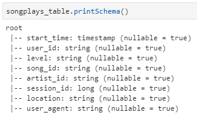

# spark_datalake
A simple project making a data lake using Apache Spark. ETL python script is the main program.

## Project Introduction
A music streaming startup, Sparkify, has grown their user base and song database even more and want to move their data warehouse to a data lake. Their data resides in S3, in a directory of JSON logs on user activity on the app, as well as a directory with JSON metadata on the songs in their app.

In this project, I am going to build an ETL pipeline using knowledge of data lake and **Apache Spark**. The ETL pipeline would read JSON files from AWS S3 and load them into **Apache Spark**, where original data transformed into star schema (a set of dimensional tables and a fact table) so analytics team can use them for finding insights like what songs played by whom, when, and where. 

## Project Goal
Using AWS S3, AWS EMR, and **Apache Spark**, build an ETL pipelie which transforms data into star schema for use by analytics team.


[Excerpt from Jacek Laskowski's GitBook](https://jaceklaskowski.gitbooks.io/mastering-apache-spark/spark-overview.html)

#### 1. What is Apache Spark

<a href="http://spark.apache.org/">Apache Spark</a> is an open-source distributed general-purpose cluster computing framework with (mostly) in-memory data processing engine that can do ETL, analytics, machine learning and graph processing on large volumes of data at rest (batch processing) or in motion (streaming processing) with rich concise high-level APIs for the programming languages: Scala, Python, Java, R, and SQL.


In contrast to Hadoop’s two-stage disk-based MapReduce computation engine, Spark’s multi-stage (mostly) in-memory computing engine allows for running most computations in memory, and hence most of the time provides better performance for certain applications, e.g. iterative algorithms or interactive data mining 


#### 2. Why Apache Spark

  - Easy to Get Started
  - Unified Engine for Diverse Workloads
  - Leverages the Best in distributed batch data processing
  - RDD - Distributed Parallel Scala Collections
  - Rich Standard Library
  - Unified development and deployment environment for all
  - Interactive Exploration / Exploratory Analytics
  - Data Integration Toolkit with Rich Set of Supported Data Sources
  - Low-level Optimizations
  - Excels at low-latency iterative workloads
  - ETL done easier

## Datasets

#### 1. Song Dataset
This data is a real data from the [Million Song Dataset](http://millionsongdataset.com/). Each file is in JSON format and contains metadata about a song and the artist of that song. The files are partitioned by the first three letters of each song's track ID. For example, here are filepaths to two files in this dataset.

```
song_data/A/B/C/TRABCEI128F424C983.json
song_data/A/A/B/TRAABJL12903CDCF1A.json
```

And below is an example of what a single song file, TRAABJL12903CDCF1A.json, looks lik

```
{"num_songs": 1, "artist_id": "ARJIE2Y1187B994AB7", "artist_latitude": null, "artist_longitude": null, "artist_location": "", "artist_name": "Line Renaud", "song_id": "SOUPIRU12A6D4FA1E1", "title": "Der Kleine Dompfaff", "duration": 152.92036, "year": 0}
```

#### 2. Log Dataset
Log files in JSON format generated by this [event simulator]https://github.com/Interana/eventsim) based on the song dataset. These simulate app activity logs from an imaginary music streamin gapp based on configuration settings.

Log files are partitioned by year and month. For example, here are filepaths to two files in this dataset.

```
log_data/2018/11/2018-11-12-events.json
log_data/2018/11/2018-11-13-events.json
```

And below is an example of what the data in a log file, 2018-11-12-events.json, looks like.


## Project Steps

#### 0. Create Spark running environment: AWS EMR cluster, EMR notebook, and S3

  - AWS EMR provides an easy setup of Apache Spark running environment.
  
#### 1. Create a SparkSession

  - SparkSession is an entry point to programming Spark with the Dataset and DataFrame API

#### 2. Load and process Song dataset

  - Read Song dataset from S3 and load into Spark
  - Transform into songs and artists dimention tables using Spark
  - Write dimension tables back to S3 in parquet files, where each table is saved into its own folder
  - songs table files are partitioned by year and then artist
  
#### 3. Load and process Log dataset

  - Read Log and Song dataset from S3 and load into Spark
  - Transform into two dimension tables(users, time) and a fact table(songplays) using Spark
  - Write tables back to S3 in parquet files, where each table is saved into its own folder
  - time table files are partitioned by year and month
  - songplays table files are partitioned by year and month
  
#### 4. Close SparkSession

  - Stop call to SparkSession stops its underlying SparkContext


## Schema for Song play analysis

#### `Fact table`
1. `songplays` 
  - Fields: songplay_id, start_time, user_id, level, song_id, artist_id, session_id, location, user_agent
  - Only include records with page value is 'NextSong' from Log dataset
  - Partitioned by year and month
  - songplays schema
  

#### `Dimension tables`
1. `users`
  - Fields: user_id, first_name, last_name, gender, level
  - user_id field must be unique
  - Keep the last 'level' value of each user in Log dataset
  - users schema
  
  
2. `songs`
  - Fields: song_id, title, artist_id, year, duration
  - song_id field must be unique
  - Partitioned by year and then artist
  - songs schema
  
  
3. `artists`
  - Fields: artist_id, name, location, lattitude, longitude
  - artist_id field must be unique
  - artists schema
  
  
4. `time`
  - Fields: start_time, hour, day, week, month, year, weekday
  - start_time field must be unique
  - Partitioned by year and month
  - time schema
  


## Project Files

#### 1. dl.cfg

  - Configuration file having AWS Access Key info

#### 2. etl.py

  - Python code with ETL pipeline

## Running Programs
With AWS EMR cluster is running and configuration is properly done

#### 1. Run ETL
```python
python etl.py
```

## ETL Result Check

#### 1. Compare `songs` data before writing to S3 and after writing to (& reading from) S3

  - Record count of songs table before writing to S3
``` 
print(songs_table.count())
```


  - Record counts of songs table read from S3
``` 
songs_table_s3 = spark.read.option("mergeSchema", "true").format('parquet').load('S3_PATH_TO_songs_table_FOLDER')
print(songs_table_s3.count())
```


  - Top 5 records of songs table before writing to S3
```
songs_table.orderBy('song_id').show(5)
```


  - Top 5 records of songs table read from S3
```
songs_table_s3.orderBy('song_id').show(5)
```


#### 2. Compare `songplays` data before writing to S3 and after writing to (& reading from) S3
```
songplays.show(1)
```


```
songplays_table_s3 = spark.read.option("mergeSchema", "true").format('parquet').load('S3_PATH_TO_songplays_table_FOLDER')
songplays_table_s3.show(1)
```


